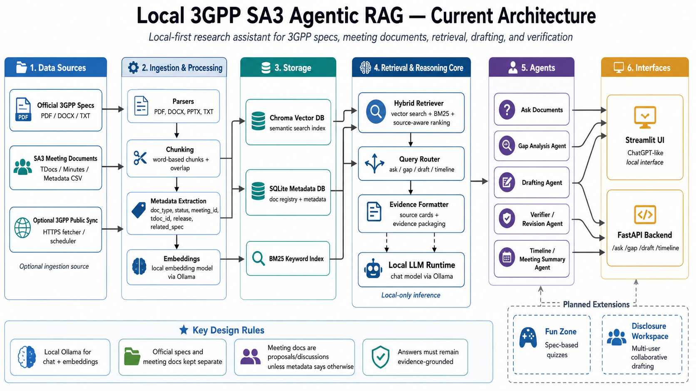

# Local 3GPP SA3 Agentic RAG

Local 3GPP SA3 Agentic RAG is a local-first research assistant for 3GPP SA3 and telecom-security research. It is designed to ingest official 3GPP specifications and SA3 meeting/TDoc material, preserve source metadata, retrieve evidence, analyze specification gaps, draft SA3-style contribution text, and verify whether generated claims are supported by source documents.

The runtime RAG system uses local models through Ollama and does **not** require the OpenAI API.

---

## Architecture



The system follows a source-aware RAG architecture:

```text
3GPP specs + meeting/TDoc documents
        ↓
Parsing, chunking, metadata extraction
        ↓
Embeddings + Chroma vector DB + SQLite metadata + BM25 index
        ↓
Hybrid retrieval and query routing
        ↓
Answering, gap analysis, drafting, verification, and timeline agents
        ↓
Streamlit UI and optional FastAPI backend
```

A central design rule is that official specifications and meeting documents remain separated. Meeting proposals, company contributions, and TDocs must not be treated as approved requirements unless the metadata explicitly marks them as approved, agreed, or reflected in an official specification.

---

## Project Goal

The goal is to build a local agentic RAG system for 3GPP SA3 and telecom-security research.

The system should support:

* Evidence-grounded question answering over 3GPP specifications.
* Retrieval over SA3 meeting documents, TDocs, minutes, and metadata.
* Clear separation between official specifications and meeting-level proposals.
* Gap analysis across specifications and meeting discussions.
* Drafting of cautious SA3-style contribution text.
* Verification of generated drafts against retrieved evidence.
* A ChatGPT-like local interface for interactive research.
* Optional API access through FastAPI.

---

## Current Features

The current implementation includes:

* Official specification ingestion.
* Meeting document ingestion with metadata support.
* Local document parsing for supported formats.
* Word-based chunking with overlap.
* Local embeddings through Ollama.
* Chroma vector database storage.
* SQLite metadata registry.
* BM25 keyword search.
* Hybrid retrieval combining semantic and keyword search.
* Source-aware evidence formatting.
* Local LLM answer generation through Ollama.
* Streamlit UI.
* Optional FastAPI backend.
* Initial support for gap analysis, drafting, verification, and timeline-style workflows.

---

## Local Runtime Stack

The project is local-first and uses:

* **Ollama** for the local chat LLM.
* **Ollama embedding model** for local embeddings.
* **Chroma** for the vector database.
* **SQLite** for metadata storage.
* **BM25** for keyword search.
* **Python** for ingestion, retrieval, and agent logic.
* **Streamlit** for the local chat UI.
* **FastAPI** for optional API access.

The runtime RAG system does not require the OpenAI API.

---

## Recommended Models

Pull the required local models with Ollama:

```bash
ollama pull llama3.2:3b
ollama pull llama3.1:8b
ollama pull nomic-embed-text
```

For debugging on a laptop, start with:

```text
llama3.2:3b
```

For better answer quality, test later with:

```text
llama3.1:8b
```

The embedding model should remain:

```text
nomic-embed-text
```

---

## Setup

Create a virtual environment:

```bash
python -m venv .venv
```

Activate it:

```bash
source .venv/bin/activate
```

Install dependencies:

```bash
pip install -r requirements.txt
```

When using WSL, it is often safer to call Python explicitly from the virtual environment:

```bash
.venv/bin/python
```

---

## Data Layout

Local documents should be placed under the ignored `data/` directory.

Example structure:

```text
data/
├── specs/
│   └── TS_33_501/
│       ├── raw/
│       └── extracted/
└── meetings/
    └── SA3/
        ├── documents/
        └── metadata.csv
```

The `data/` directory is ignored by git. Do not commit downloaded 3GPP documents, private meeting files, generated databases, or local indexes.

---

## Indexing Official Specifications

Place official 3GPP specification files under `data/specs/`.

Then run:

```bash
.venv/bin/python scripts/index_specs.py
```

Example for TS 33.501:

```text
data/specs/TS_33_501/extracted/33501-i90.docx
```

After indexing, the chunks are stored in Chroma and document metadata is registered in SQLite.

---

## Indexing Meeting Documents

Place meeting documents under `data/meetings/`.

Then run:

```bash
.venv/bin/python scripts/index_meetings.py
```

Meeting metadata should be provided through a CSV file where possible.

Example metadata fields:

```text
file_path,meeting_id,tdoc_id,source_company,status,meeting_date,related_spec
```

Important status examples:

```text
discussion
proposal
noted
agreed
approved
rejected
withdrawn
```

Meeting documents should not be interpreted as official requirements unless the metadata clearly supports that interpretation.

---

## Running the Streamlit UI

Run the local ChatGPT-like interface:

```bash
HOME=/tmp .venv/bin/streamlit run app_streamlit.py
```

The UI is intended for:

* Asking questions over indexed documents.
* Viewing retrieved evidence.
* Running gap analysis.
* Drafting SA3-style text.
* Reviewing verifier feedback.

---

## Running the FastAPI Backend

Run the optional API backend:

```bash
.venv/bin/uvicorn app_fastapi:app --reload
```

Typical planned endpoints include:

```text
/ask
/gap
/draft
/timeline
```

---

## Testing

Run all tests with:

```bash
PYTHONPATH=. .venv/bin/pytest
```

Run compile checks with:

```bash
.venv/bin/python -m compileall -q rag app_fastapi.py app_streamlit.py scripts
```

---

## Example Local RAG Test

After indexing documents, test the pipeline from the terminal:

```bash
.venv/bin/python - << 'PY'
from rag.pipeline import answer_question

print(answer_question(
    "What does TS 33.501 say about Service-Based Architecture security?"
))
PY
```

For a smaller manual RAG test:

```bash
.venv/bin/python - << 'PY'
from rag.retriever import hybrid_search, format_evidence
from rag.llm import call_local_llm

question = "What does TS 33.501 say about SBA domain security?"

results = hybrid_search(
    question,
    search_specs=True,
    search_meetings=False,
    k_vector=3,
    k_keyword=3,
)

evidence = format_evidence(results[:3], max_chars_per_chunk=800)

prompt = f"""
Answer the question using only the evidence.

Question:
{question}

Evidence:
{evidence}

Give a concise answer with [Evidence X] references.
"""

print("Evidence chars:", len(evidence))
print(call_local_llm(prompt))
PY
```

---

## Design Rules

The system follows these rules:

1. Official specifications and meeting documents must remain clearly separated.
2. Meeting proposals are not approved requirements unless metadata says they are approved, agreed, or incorporated into an official specification.
3. Generated answers must be evidence-grounded.
4. The system should not invent clause numbers, TDoc IDs, company names, or meeting decisions.
5. If evidence is weak or missing, the answer should say so.
6. Acronyms must be handled in the 3GPP context. For example, SBA means Service-Based Architecture unless the evidence clearly states otherwise.
7. Drafting agents should distinguish between:

   * official specification text,
   * meeting discussion,
   * identified gap,
   * proposed contribution text,
   * model inference.

---

## Important 3GPP Acronym Notes

Common SA3/security acronyms used in this project include:

```text
SBA   = Service-Based Architecture
NF    = Network Function
NRF   = Network Repository Function
AUSF  = Authentication Server Function
UDM   = Unified Data Management
SEPP  = Security Edge Protection Proxy
SUPI  = Subscription Permanent Identifier
SUCI  = Subscription Concealed Identifier
```

The model should not expand acronyms incorrectly. If an acronym is ambiguous, the system should state the uncertainty instead of guessing.

---

## Planned Extensions

Two planned modules may be added on top of the core RAG system.

### Fun Zone

A learning mode for 3GPP security concepts, including:

* Spec-based quizzes.
* Multiple-choice questions.
* True/false questions.
* Clause-matching questions.
* Scenario-based questions.
* Evidence-backed explanations.

### Disclosure Workspace

A collaborative workspace for preparing research disclosures or SA3-style contributions, including:

* Multi-user drafting.
* Shared sections.
* Comments.
* Version history.
* Evidence links.
* Verifier warnings.
* Claim-to-source traceability.

---

## Local Data Warning

The `data/` directory is ignored by git and should contain local documents only.

Put downloaded 3GPP specifications, meeting documents, TDocs, metadata files, generated indexes, and other large or sensitive files under `data/`.

Do not remove `.gitignore` protections for:

```text
data/
chroma_db/
metadata.sqlite
.env
.venv/
__pycache__/
.pytest_cache/
```

---

## Repository Hygiene

Before pushing to GitHub, check what will be committed:

```bash
git status
```

Make sure large local files are not staged:

```bash
git status --short
```

Add source files and documentation only:

```bash
git add README.md docs/images/local_3gpp_sa3_agentic_architecture_diagram.png
```

Commit:

```bash
git commit -m "Add architecture diagram and improve README"
```

Push:

```bash
git push -u origin main
```

---

## Disclaimer

This project is a research assistant for 3GPP SA3/security work. It does not replace official 3GPP specifications, meeting reports, or expert review. Always verify generated answers and drafts against official source documents before using them in research, publication, or standardization work.
